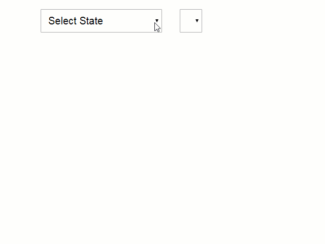

# Indian-States-Cities Dropdown List

Cities.js is JavaScript library to create Indian State & City dropdown lists containing all the States names and Cities names.



## Index

```
<html>
<head>
    <script src="cities.js"></script>
</head>
<body>
<select onchange="print_city('state', this.selectedIndex);" id="sts" name ="stt" class="form-control" required></select>
<select id ="state" class="form-control" required></select>
<script language="javascript">print_state("sts");</script>
</body>
</html>

```
## cities.js

```
var state_arr = new Array("Andaman & Nicobar");

var s_a = new Array();
s_a[0]="";
s_a[1]=" Alipur | Andaman Island | Anderson Island | Arainj-Laka-Punga | Austinabad | Bamboo Flat | Barren Island ";

function print_state(state_id){
	// given the id of the <select> tag as function argument, it inserts <option> tags
	var option_str = document.getElementById(state_id);
	option_str.length=0;
	option_str.options[0] = new Option('Select State','');
	option_str.selectedIndex = 0;
	for (var i=0; i<state_arr.length; i++) {
		option_str.options[option_str.length] = new Option(state_arr[i],state_arr[i]);
	}
}

function print_city(city_id, city_index){
	var option_str = document.getElementById(city_id);
	option_str.length=0;	// Fixed by Julian Woods
	option_str.options[0] = new Option('Select City','');
	option_str.selectedIndex = 0;
	var city_arr = s_a[city_index].split("|");
	for (var i=0; i<city_arr.length; i++) {
		option_str.options[option_str.length] = new Option(city_arr[i],city_arr[i]);
	}
}

```
## Version

1.0

## Authors

 Ajay Randhawa
 
 ### Happy open Source....
